# Campus Clash - Torneo con Árbol Binario - Estructura de Datos

Este proyecto es una aplicación desarrollada en **Java** para la gestión de un torneo, empleando un árbol construido manualmente para representar la jerarquía de partidos.

### 📂 Ubicación del Código
El código fuente principal con toda la lógica del programa se encuentra en la siguiente ruta:
`src > estructura4 > Estructura4.java`

### 🛠️ Detalles de la Implementación

* **Estructura de Datos:** Implementación de un árbol binario manual mediante la clase interna `Nodo`, donde la raíz representa la final y sus hijos izquierdo y derecho representan las dos semifinales.
* **Modelado de Datos:** Creación de las clases internas `Nodo` y `Equipo` para encapsular los atributos de cada partido (equipos participantes y ganador) y de cada equipo (código y nombre).
* **Registro de Equipos:** Uso de un `ArrayList` para almacenar los equipos disponibles antes de ser asignados al árbol del torneo.
* **Asignación Manual:** El usuario decide explícitamente en qué semifinal coloca cada equipo, lo que da control total sobre los enfrentamientos.
* **Gestión de Errores:** Control de flujo preventivo con validaciones en cada opción para evitar estados inválidos, como registrar ganadores antes de formar los partidos o asignar un equipo ya existente.
* **Interfaz de Consola:** Menú interactivo continuo diseñado para seguir el flujo natural del torneo: registrar, asignar, jugar semifinales, jugar final y ver el cuadro.

> **Nota para el profesor:** He subido el proyecto completo a este repositorio de GitHub para garantizar la visualización del código con total claridad y complementar la documentación técnica entregada.

---

## 🌳 Arquitectura del Sistema
El torneo se estructura bajo la siguiente jerarquía de nodos:

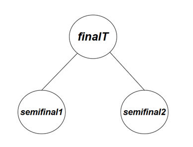

---

## 💻 Capturas de la Implementación (Consola)
A continuación se muestran las pruebas de ejecución del sistema, demostrando el flujo completo del torneo:

### Imágenes 1 y 2: Registro de equipos
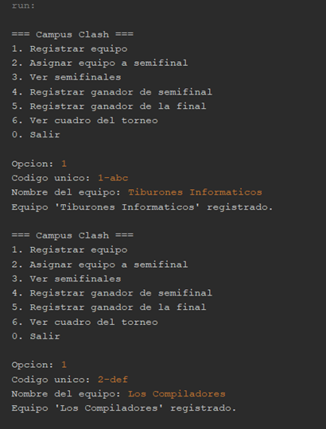

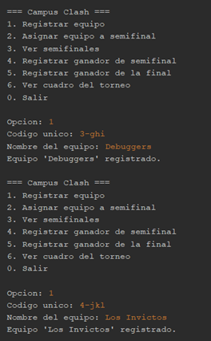

### Imágenes 3 y 4: Asignación de equipos a semifinales
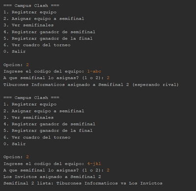

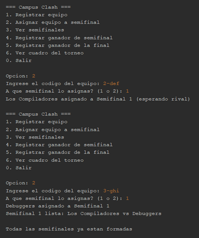

### Imagen 5: Visualización de semifinales
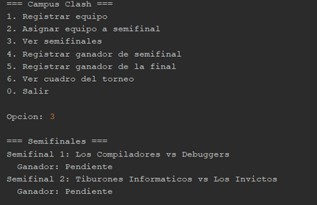

### Imágenes 6, 7, 8 y 9: Registro de ganador de semifinal y formación de la final
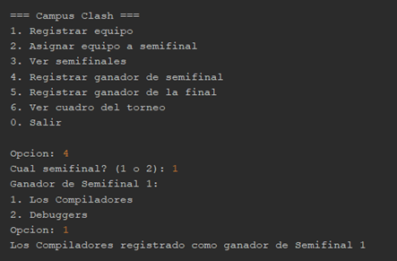

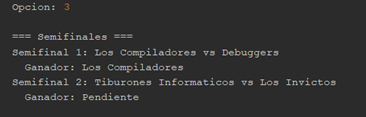

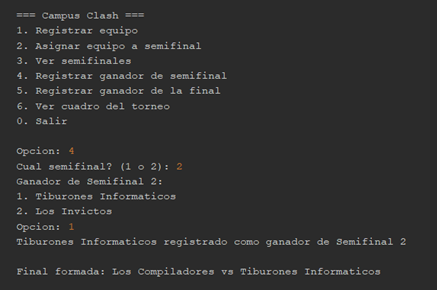

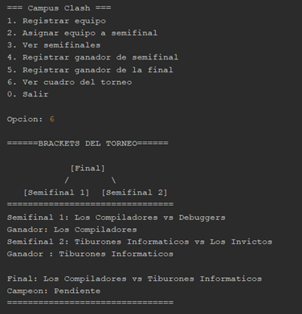

### Imagen 10: Registro del campeón
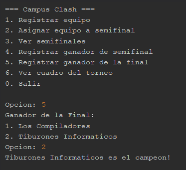

### Imagen 11: Cuadro del torneo
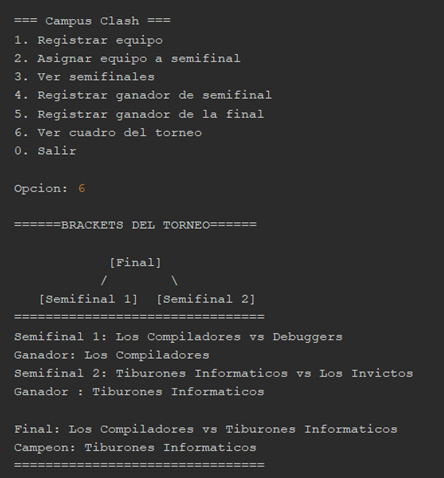

### Imágenes 12 y 13: Validaciones
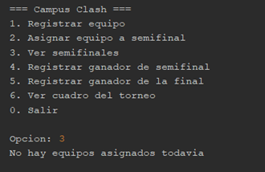

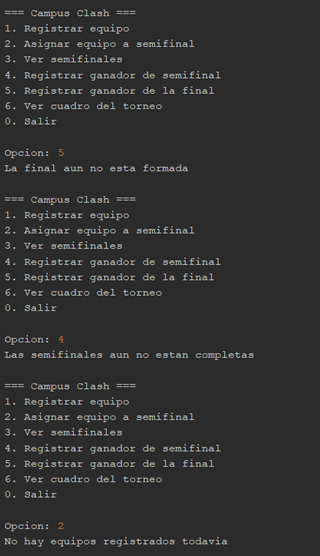

---

**Desarrollado por:** Víctor Manuel Cordoba Larez  
**Carrera:** Ingeniería Informática  
**Materia:** Estructura de Datos  
**Institución:** Corporación Universitaria Lasallista
